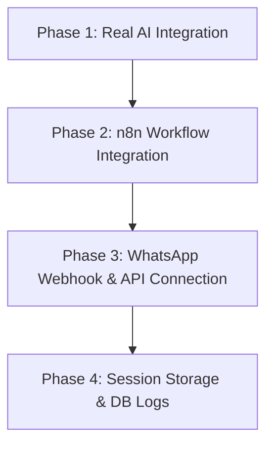

# Project Roadmap & Suggested Next Steps

This document outlines the current status of the **n8n Practice** project and provides a step-by-step roadmap to integrate your Next.js chat interface, Express backend, n8n workflows, and the WhatsApp Business API.

---

## 🔍 Current Project Status

Your codebase is structured as a decoupled full-stack application:

* **Frontend (`n8n_frontend`)**: 
  * A modern Next.js client with a responsive, Messenger-like chat interface ([ChatBox.tsx](file:///c:/Projects/n8n_Practice/n8n_frontend/src/components/ChatBox.tsx)).
  * Connects to the local backend server via Axios on `http://localhost:5000/chat`.
  * Preloaded with a WhatsApp API token in [.env](file:///c:/Projects/n8n_Practice/n8n_frontend/.env).
* **Backend (`n8n_Backend`)**:
  * An Express server ([server.js](file:///c:/Projects/n8n_Practice/n8n_Backend/server.js)) handling chat requests.
  * Currently uses a local keyword-matching database (`generateReply`) to simulate an assistant.
* **Automation (`n8n`)**:
  * An empty directory reserved for workflow setups.

---

## 🚀 Suggested Implementation Roadmap

We suggest implementing the project in four incremental phases:



### 🔹 Phase 1: Real AI Integration (Fastest Value)
Instead of matching static keywords, connect your backend to a live Large Language Model (like Gemini or OpenAI).

1. **Add Gemini SDK to Backend**:
   Run the following in `n8n_Backend`:
   ```bash
   npm install @google/generative-ai
   ```
2. **Configure Environment Variables**:
   Add `GEMINI_API_KEY` to your backend `.env` file.
3. **Update Chat Logic**:
   Modify `generateReply` in `server.js` to initialize the Gemini client and query the model dynamically.

---

### 🔹 Phase 2: n8n Workflow Integration (The Automation Core)
n8n is ideal for connecting your chat system to external APIs, databases, or CRM tools when a message is received.

1. **Start n8n locally**:
   You can start n8n using Docker or npm:
   ```bash
   npx n8n start
   ```
2. **Create a Webhook Workflow in n8n**:
   * **Trigger**: Webhook node (POST method).
   * **Logic**: AI Agent node or HTTP Request node to call an LLM or fetch user data.
   * **Response**: Respond to Webhook node returning the final message.
3. **Connect Backend to n8n**:
   Update `server.js` to send requests directly to your local n8n Webhook URL rather than processing them locally.

---

### 🔹 Phase 3: WhatsApp Webhook & Messaging (Multi-Channel)
Connect the application to WhatsApp so users can send messages to a WhatsApp number and receive replies processed by your backend/n8n workflow.

1. **Add WhatsApp Webhook Verification Route**:
   Add a `GET /webhook` route in `server.js` to verify your webhook subscription with Meta:
   ```javascript
   app.get("/webhook", (req, res) => {
       const mode = req.query["hub.mode"];
       const token = req.query["hub.verify_token"];
       const challenge = req.query["hub.challenge"];
       
       if (mode && token === "YOUR_VERIFY_TOKEN") {
           res.status(200).send(challenge);
       } else {
           res.sendStatus(403);
       }
   });
   ```
2. **Add Message Handler Route**:
   Add a `POST /webhook` route to receive real-time message notifications from Meta.
3. **Send Message Logic**:
   Write a helper function to send response messages back to the WhatsApp API using your `WHATSAPP_API_KEY` stored in your environment.

---

### 🔹 Phase 4: Database & User Management (Production Quality)
Make the application robust by adding state management and session tracking.

1. **Persistent History**: Store incoming and outgoing messages in MongoDB or PostgreSQL so users can see chat history on refresh.
2. **Session IDs**: Identify users uniquely using `userId` (passed from the frontend) to segment chat histories.

---

## 🛠️ Recommended Action Items to Start Today

1. **Step 1**: Let's replace the hardcoded chat logic with the **Gemini API** or **n8n Webhook** first.
2. **Step 2**: Create the webhook receiver route in the backend for WhatsApp notifications.

*Let me know which step you'd like to implement first, and I will write the code/configuration for you!*
